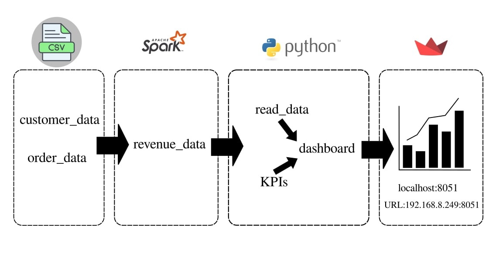
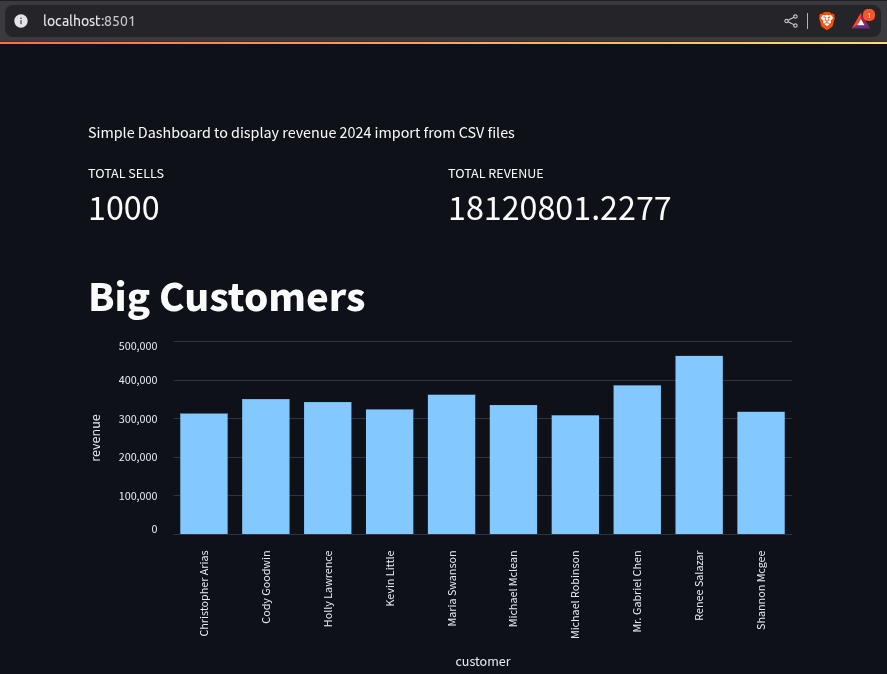

# streamlit_data_visualization

# *Overview*
Repo project to demonstrate Data visualization using Streamlit, input data from customer_data.csv & order_data.csv file through data processing using PySpark to revenue_data.csv. Using Streamlit to display the dashboard into web through
```URL
localhost:8051
```
```URL
https://192.168.249:8051
```
# *Prerequisites*
To follow along this project we need to ensure python3 installed with pyspark & streamlit
  ```bash
  python3 --version
  ```
  ```bash
  pip install pyspark, streamlit  
  ```
# *Project Flow*
1. Data Processing two CSV files querying using pyspark
   ```python3
   # Import necessary library
   from pyspark.sql import SparkSession
   from pyspark.sql.functions import col, format_number
   from pyspark.sql.types import DoubleType, IntegerType

   # Initilization Spark Session
   spark = SparkSession.builder.appName("Data Revenue").getOrCreate()
   ```
   ```python3
   join_df = spark.sql(join_query)
    formated_df = join_df.withColumn("REVENUE", join_df["REVENUE"].cast(DoubleType()))

    if formated_df is not None:
        formated_df.printSchema()
        formated_df.show(10)
        formated_df.write \
            .mode("overwrite") \
            .option("header",True) \
            .csv("/home/mulyo/Learning/ELT/Converted")

    spark.stop()
   ```
2. Data Visualization using Streamlit
   ```python3
   # Import necessary library
   import streamlit as st
   from read_data import read_data 
   from kpis import number_sells, total_revenue, bigs

   df = read_data()

   chart_data = bigs
   ```
   ```python3
   # Display total sells & total revenue
   labels = ("TOTAL SELLS", "TOTAL REVENUE")
   cols = st.columns(2)
   kpis = (number_sells, total_revenue)
   ```
   ```python3
   # Display Big Customer as Bar Chart
   st.title("Big Customers")

   st.bar_chart(chart_data, x="customer", y="revenue")
   ```
   ```python3
   # Display RAW data
   st.markdown("# Raw Data")
   st.dataframe(df)
   ```
3. Streamlit result access from web browser: localhost:8501
    
